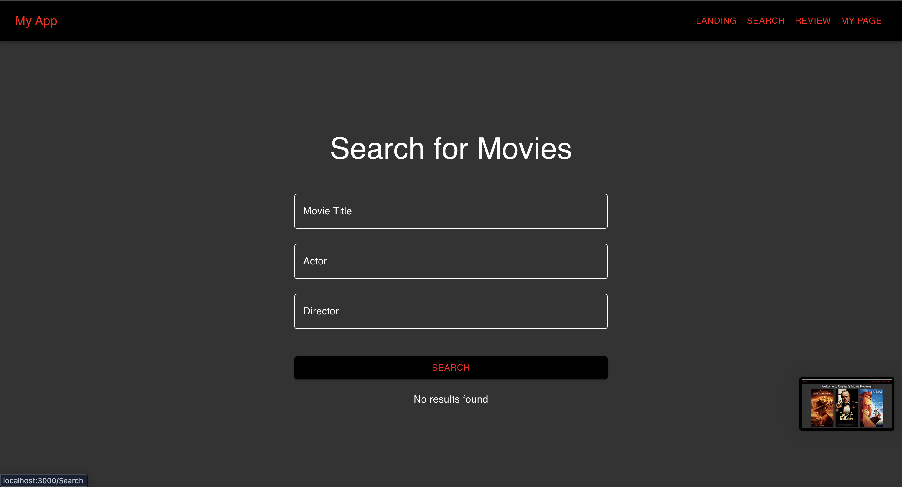
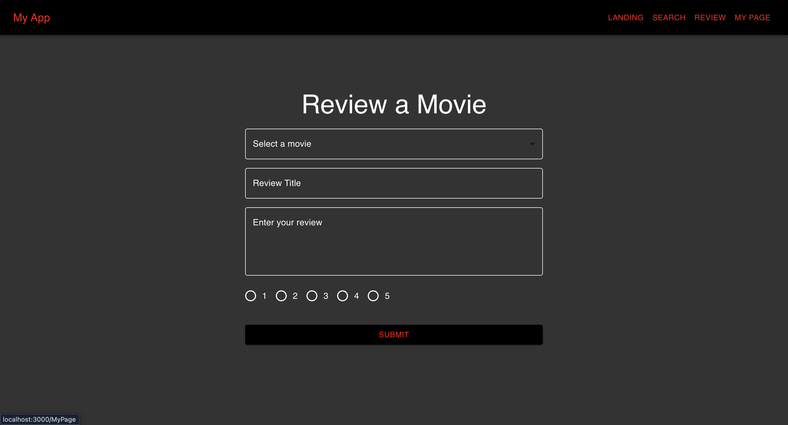
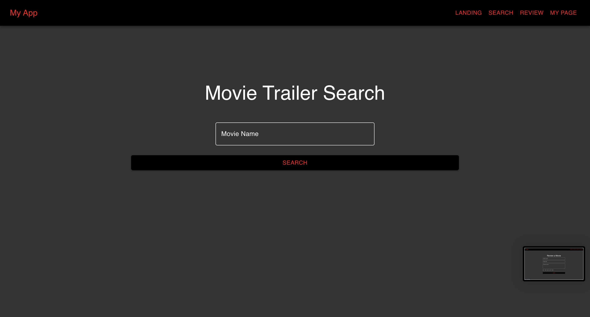

# Movie Review Website

A full-stack web application that allows users to search for movies, read and submit reviews, and watch movie trailers. The application connects a React frontend with a Node.js backend and a MySQL database to dynamically retrieve and display movie data.

This project was developed as part of a university course to practice building a complete full-stack web application.

---

## Features

### Movie Search
Users can search for movies by:
- Movie title
- Actor
- Director

Search results display matching movies along with information pulled from the database.

### Submit Reviews
Users can:
- Select a movie from a dropdown menu
- Write a review title
- Write a full review
- Rate the movie from 1–5

Reviews are stored in the MySQL database and can be retrieved by the application.

### Watch Movie Trailers
A custom feature implemented for the **My Page** requirement.

Users can:
- Search for a movie
- Instantly watch the movie trailer directly on the page

The trailer is fetched dynamically from the database.

---

## Tech Stack

Frontend
- React
- JavaScript
- HTML
- CSS
- Material UI

Backend
- Node.js
- Express.js

Database
- MySQL

Other
- REST API for communication between frontend and backend

---

## Application Architecture

The application follows a typical full-stack architecture:
React Frontend
↓
Node.js / Express API
↓
MySQL Database

- The frontend sends API requests to the backend
- The backend queries the MySQL database
- Data is returned and displayed dynamically in the UI

---

## Pages

### Landing Page
Displays featured movie posters and navigation to the main features of the application.

### Search Page
Allows users to search for movies by title, actor, or director.

### Review Page
Users can submit movie reviews and ratings.

### My Page – Movie Trailer Search
A custom feature where users can search for a movie and watch its trailer directly on the page.

---

## Screenshots

### Landing Page

### Search Movies

### Submit Review

### Trailer Search

---

## Learning Outcomes

Through this project I gained experience with:

- Building full-stack applications
- Creating REST APIs
- Connecting a React frontend to a Node backend
- Querying relational databases using MySQL
- Designing interactive UI components
- Managing application state in React

---

## Future Improvements

Potential enhancements include:

- User authentication
- Displaying average review scores
- Movie recommendation system
- Improved UI/UX design
- Pagination and improved search performance

---

## Author

Cristian Craciun

Management Engineering Student  
University of Waterloo